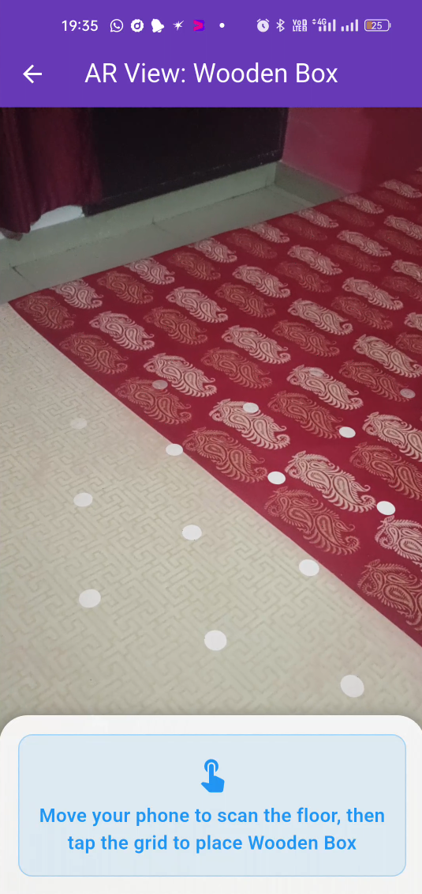
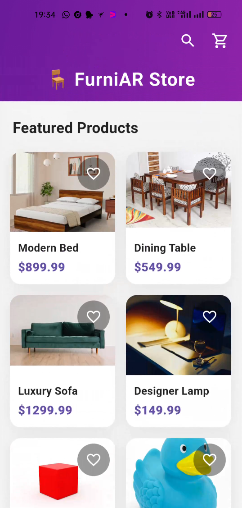
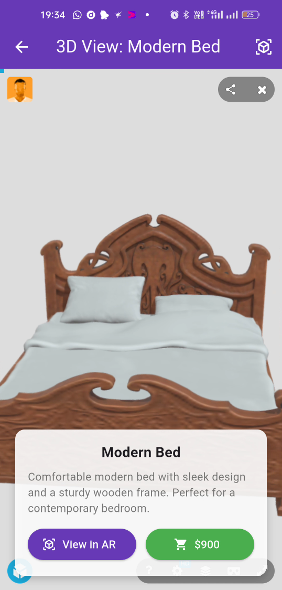

# 🪑 FurniAR – AR Furniture E-Commerce App

FurniAR is an innovative Flutter mobile app that lets users preview and visualize furniture products in interactive 3D and Augmented Reality. Blending a modern shopping experience with Sketchfab 3D view, AR placement, and a Firebase-ready backend, FurniAR gives users the confidence to shop for furniture—and see it in their room—before making a purchase.

---

## 🚀 Features

- Beautiful E-Commerce UI – Modern, responsive grid, product detail, cart, and order tracking
- Interactive 3D Model Viewer – Embedded Sketchfab players for full model rotation and inspection
- AR Placement – Place real furniture in your space using ARCore/ARKit; supports any GLB file
- Multi-Role Support – Buyers, admins, and sellers, all on one app
- Firebase Integration – Cart, payments, customer reviews, delivery status updates, live sync
- Dark & Light Theme – Professional UI adapts to system theme
- Delivery Tracking – Sellers can update, buyers can see real-time ETA (future: full delivery API)
- Debug/Performance Mode – Use lightweight models (like “Rubber Duck” or “Box”) for low-end devices

---

## 📷 Screenshots

---

## 📥 Download Link for Debug APK

[Download FurniAR debug APK](https://drive.google.com/file/d/15xHaJL1ZQu6X_IIyqccTt8_Ozf-1Sdbq/view?usp=sharing)

> **Note:** The AR viewer may not be supported by all devices due to Google's slow rolling out of ARCore compatibility.  
> Check if your device supports ARCore here:  
> [Google ARCore Supported Devices](https://developers.google.com/ar/devices)

---

## Get Started!
git clone https://github.com/mehrishisarthak/furniAR
cd furniAR
flutter pub get
flutter run

---

## 💡 Tech Stack

- Flutter 3.x (Dart)  
- ar_flutter_plugin (for ARCore/ARKit)  
- Sketchfab (in-app 3D model viewer)  
- Firebase (auth, Firestore, payments, real-time sync)  
- Path provider (for GLB asset handling)  
- vector_math (for transform/scale math)  

---

## 📱 Device Support & AR Advice

- **Android:** Requires ARCore (unstable on some old/budget phones; flagship recommended)
- **iOS:** ARKit runs smoother, more stable, better for demo/showcase
- **Low-end devices:** Heavy models may crash; use small ones (e.g., “Box”, “Rubber Duck”)

---

## 📝 Known Issues

- AR performance may lag/crash on low-spec Android devices
- Cannot build release APK due to version conflicts/errors
- Materialization problems with some 3D models
- ARKit support (iOS) is generally smoother and updated more frequently
- Large/high-poly models can overload mobile hardware—optimize for best results
- The app works great as a furniture browser and 3D viewer even if AR is unavailable!

---

## 👤 Author

**Sarthak Mehrishi**  
[LinkedIn](https://www.linkedin.com/in/sarthak-mehrishi-58128a2b7)  
[GitHub](https://github.com/mehrishisarthak)
